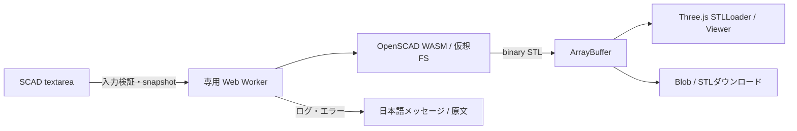

# アーキテクチャ

## 構成と設計判断

| 要素 | 実装と目的 |
| --- | --- |
| UI | TypeScript / Vite。標準textareaでキーボード・タッチ操作を維持 |
| エンジン | 入力ソースを固定してビルドしたOpenSCAD WASM。配布版とSHA-256は `engine-build/release.json` に記録 |
| 実行 | 生成ごとに専用Web Workerを起動し、終了・中止・制限時間到達時に破棄 |
| プレビュー | Three.js / STLLoader / OrbitControls。生成したSTLを表示し、同じバイトを保存 |
| データ | コードとモデルは端末内で処理。サーバーへ送信せず、ブラウザにも永続保存しない |
| 配信 | 静的アセットと、Cloudflare Pages向けの認証ゲート。エンジンも同一originから取得 |
| ブラウザ | WebAssembly・module Worker・WebGL2が必要。自動テストと実端末の検証範囲は `verification.md` に記録 |

## データフロー

SCADの座標系はZ-up。表示のためだけに座標を書き換えない。STLは単位情報を持たないため1単位を1mmとして案内。編集後は前のプレビューを明示し、再生成までダウンロードを無効にする。

## 安全性と制約

- 60秒の期限はメインスレッドで監視しWorker.terminate()。中止も同じ経路。コード200KB、STL25MB、ログ64KBを上限とする。
- コメントと文字列を区別した事前チェックで `include` / `use` / `import` / `surface` を拒否。外部ファイルを仮想FSにマウントしない。SCAD文字列をeval/HTML挿入に使わない。
- WorkerはUI分離でありOSプロセス隔離ではない。配布WASMのheap上限は約4GBで、任意の小さい上限を引数で指定できない。時間制限はメモリ急増によるタブ終了を完全には防げない。厳密なheap制限が必要なら固定MAXIMUM_MEMORYでWASMを再ビルドして対応ソースも更新する。
- 初回WASM約9.2MBの取得・コンパイルに時間がかかる。エンジンはボタン操作時に読み込み。ネットワークエラーと処理エラーを区別し再試行可能にする。
- 非多様体・ゼロ厚み・自己交差・印刷強度は一般的に自動保証できない。OpenSCAD警告を残す。STLを実スライサーでも検証する。
- 外部ライブラリ、ファイルimport、フォントを必要とするtext、2Dだけのモデルは対象外。2Dはlinear_extrude等で立体化して使用。

## ソースとライセンス

アプリはGPL-2.0-or-laterで提供する。配布エンジンの入力ソース、依存ライブラリ、ライセンス、ビルド手順と変更内容を対応ソースに含める。詳細は[エンジンの来歴](engine-provenance.md)と[再ビルド手順](../engine-build/README.md)を参照。

アプリのソースZIPは `scripts/prepare-source.mjs` の許可リストから生成する。認証情報、ローカル原稿、ログは含めない。
