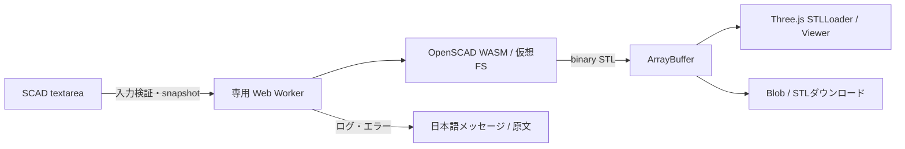

# 技術調査と設計（2026-09-19）

実装前に公式ドキュメント、配布物、npm metadataを確認した。結論は、静的ホスティングだけでMVPを実現可能。ただし実験版WASM・端末メモリ・実機検証・GPL対応ソース配布は運用上の条件になる。

## 採用判断

| 項目 | 判断・根拠 |
| --- | --- |
| クライアント完結 | SCADをWeb Workerの仮想FSに置き、OpenSCAD本体でSTL生成。サーバーへのコード送信なし |
| エンジン | 公式Playgroundが指定する `OpenSCAD-2025.03.25.wasm24456-WebAssembly-web.zip` を固定採用。2026年の最新版と同等とは主張しない |
| 既存実装 | openscad/openscad-wasmは公式組織内で継続更新。調査時の最新commitは `dc2ff913b4193b1ebfef863da3f7e84f8fbc1e11`（2026-08-02）。独自構文変換をしない |
| npm候補 | openscad-wasm 0.0.4（2025-07-18、GPL-2.0、展開約13.9MB）も調査。WASMをbase64内包し対応ソースのmetadataが不足。公式配布物を優先。openscad-wasm-prebuilt 1.2.0は2025-01-22更新の第三者fork |
| 3D | Three.js 0.186.0 / STLLoader / OrbitControls。STLを解析して表示し、元バイトをそのまま保存 |
| 非同期 | single-thread WASMをmodule Workerで実行。SharedArrayBuffer、COOP/COEPを必須にしない。1回ごとにWorkerを終了しFSとメモリを破棄 |
| 対応ブラウザ | 最新のChrome/Edge/Safariを対象。WASM・module Worker・WebGL2が必要。Windows/Mac/iPad対応の設計だが、WebKit自動テストは実機Safari/iPad検証の代替ではない |
| ホスティング | Vite静的ビルド、相対assetパス。GitHub PagesやCloudflare Pages等へ配置可能。WASMを同一originに同梱、CDN・外部フォント・分析なし |
| コスト | 静的配信のみ。40人分の初回WASM非圧縮転送は約384MB。授業前にロードし、圧縮・HTTPキャッシュを設定。ホストの無料枠は別途確認 |
| エディタ | native textareaでコピー/貼付/選択/Undo/Redoとタッチの標準動作を維持。行番号を追加し、高度なIDE依存を避ける |
| スタック | TypeScript、Vite、Three.js、公式OpenSCAD WASM。テストはNode testとPlaywright。既存リポジトリ向けソフトウェア開発としてこのフォルダに実装する |

## データフロー

SCADの座標系はZ-up。表示のためだけに座標を書き換えない。STLは単位情報を持たないため1単位を1mmとして案内。編集後は前のプレビューを明示し、再生成までダウンロードを無効にする。

## 安全性と制約

- 60秒の期限はメインスレッドで監視しWorker.terminate()。中止も同じ経路。コード200KB、STL25MB、ログ64KBを上限とする。
- コメントと文字列を区別した事前チェックで `include` / `use` / `import` / `surface` を拒否。外部ファイルを仮想FSにマウントしない。SCAD文字列をeval/HTML挿入に使わない。
- WorkerはUI分離でありOSプロセス隔離ではない。配布WASMのheap上限は約4GBで、任意の小さい上限を引数で指定できない。時間制限はメモリ急増によるタブ終了を完全には防げない。厳密なheap制限が必要なら固定MAXIMUM_MEMORYでWASMを再ビルドして対応ソースも更新する。
- 初回WASM約9.6MBの取得・コンパイルに時間がかかる。エンジンはボタン操作時に読み込み。ネットワークエラーと処理エラーを区別し再試行可能にする。
- 非多様体・ゼロ厚み・自己交差・印刷強度は一般的に自動保証できない。OpenSCAD警告を残す。STLを実スライサーでも検証する。
- 外部ライブラリ、ファイルimport、フォントを必要とするtext、2DだけのモデルはMVP対象外。2Dはlinear_extrude等で立体化して使用。

## ライセンス（実装前の明示）

OpenSCADはGPL v2系のライセンス。学校での利用自体は禁止されないが、ブラウザへのWASM配信もバイナリ配布に当たる。著作権・免責・ライセンス本文の保持、および配布版に対応する完全なソースとビルド手順（依存ライブラリ・変更を含む）の提供が必要。上流の一般的なトップページへのリンクだけで履行済みとは扱わない。

本アプリの新規ソースはGPL-2.0-or-laterで提供し、Three.js/ViteのMIT表示も保持する。TypeScriptとテスト用PlaywrightはApache-2.0。WASM内部の依存ライセンスはOpenSCADの配布条件も確認する。生成モデルにアプリのGPLを自動付与するものではない。

公式ZIPにはJS/WASMのみで対応ソース一式は入っていない。ローカル実装・検証を先行し、一般公開前にはこのバイナリに対応するソース一式の取得と提供を完了する。公開適合を確認しないまま自動デプロイしない。詳細は `docs/release-checklist.md` に記録する。

## 一次資料

- [公式WASM](https://github.com/openscad/openscad-wasm)
- [OpenSCAD公式ビルドとライセンス](https://github.com/openscad/openscad)
- [公式配布：実験版との記載](https://openscad.org/downloads.html)
- [Playgroundの採用バイナリ](https://github.com/openscad/openscad-playground/blob/main/libs-config.json)
- [固定配布物](https://files.openscad.org/playground/OpenSCAD-2025.03.25.wasm24456-WebAssembly-web.zip)
- [STLLoader](https://threejs.org/docs/pages/STLLoader.html)、[OrbitControls](https://threejs.org/docs/pages/OrbitControls.html)
- [WASM](https://developer.mozilla.org/en-US/docs/WebAssembly)、[Memory](https://developer.mozilla.org/en-US/docs/WebAssembly/Reference/JavaScript_interface/Memory)
- [Web Workersとterminate](https://developer.mozilla.org/en-US/docs/Web/API/Web_Workers_API/Using_web_workers)
- [OpenSCAD COPYING](https://github.com/openscad/openscad/blob/master/COPYING)
